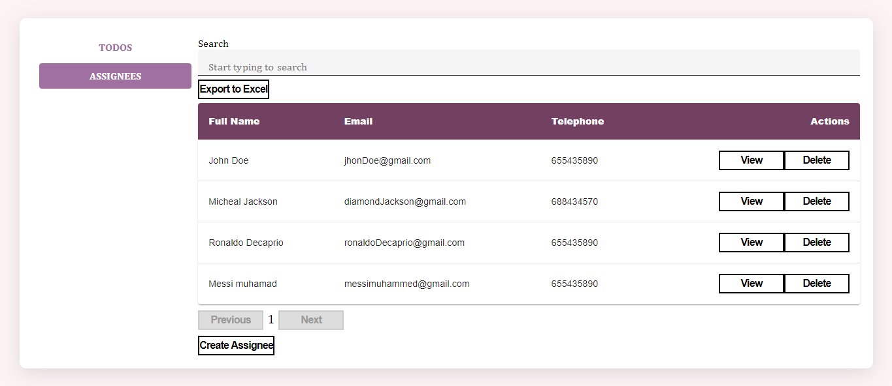
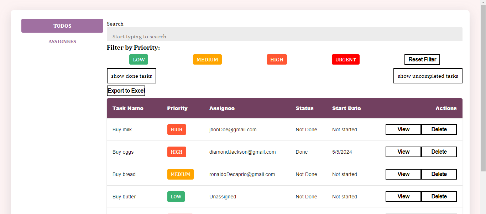
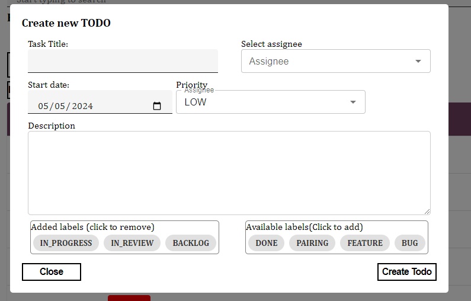

# WizeTodoList

The name of the Project

## Demo link:

Project not yet online

## Table of Content:

- [About The App](#about-the-app)
- [Screenshots](#screenshots)
- [Technologies](#technologies)
- [Setup](#setup)

## About The App

WizeTodoList is an application designed to efficiently manage users (Assignees) and tasks (Todos). Users can be added to the system via the Assignees page accessible from the sidebar. Simply click on the "Create Assignee" button and enter the user details.

Once users are created, you can navigate to the Todos page to select or create new tasks and assign them to the desired user.

## Screenshots

### Assignees page

### Todos page

### Create Todo Modal

## Technologies

This project is built using the following technologies:

- react
- typescript
- css

## Setup

To run this project locally, follow these steps:

- Clone the repository :  
  `git clone https://github.com/ojongclinton/wizeTodoList.git`
- Navigate to the project directory :  
  `cd wizeTodoList`

- Install dependencies:  
  `npm install`

- Start the development server :  
  `npm run dev`

  Once the server is running, you will see the local address (e.g., http://localhost:3000) in your terminal. Open this address in your browser to view the application.
